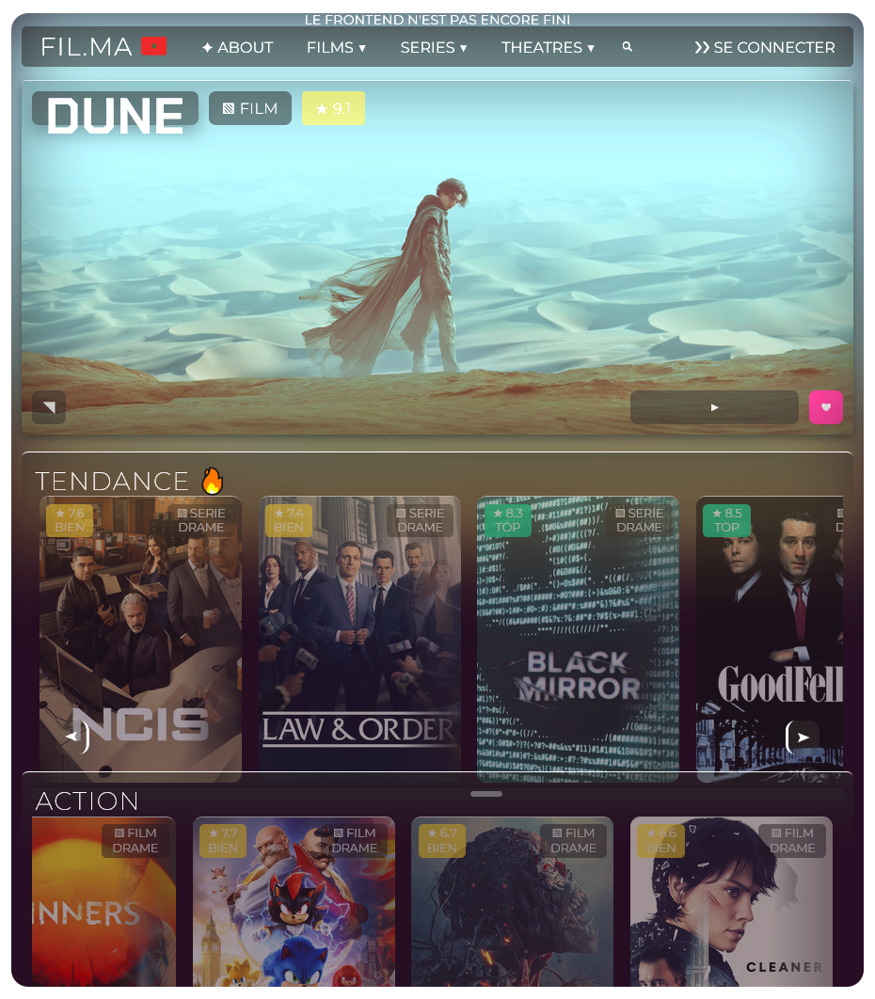

<h1 align="center">FIL.MA : PROJET DE FIN D'ETUDE</h1>


**Plateforme de streaming gratuite développée avec M.E.R.N : films/séries en HD, lecture fluide et recommandations intelligentes. UX simple et performante. 🎥🚀**

### Vous pouvez visiter le demo du site ici :
## https://filma-pfe.vercel.app

Image de site :



# F.A.Q :

**Quel est le but de notre projet ?**

L'objectif de notre projet est de créer une plateforme de streaming vidéo inspirée de Netflix, permettant aux utilisateurs de regarder des films et séries en ligne de manière fluide et personnalisée. Notre site proposera des fonctionnalités avancées telles que :

    Une recherche optimisée de contenus

    Des recommandations intelligentes basées sur les préférences

    Un streaming haute qualité adaptatif (selon la connexion)

    La gestion multi-profils pour une expérience personnalisée

Grâce à la stack M.E.R.N, notre plateforme sera réactive, sécurisée et facile à maintenir, tout en offrant une interface moderne et intuitive. 🎬🍿

**Pourquoi utiliser la stack M.E.R.N ?**

Le M.E.R.N (MongoDB, Express, React, Node.js) est un choix stratégique pour notre projet car il combine performance, flexibilité et cohérence technique :

    MongoDB : Base de données NoSQL scalable, idéale pour gérer un large catalogue de médias.

    Express : Framework backend robuste pour construire nos API rapidement.

    React : Librairie frontend dynamique, parfaite pour une UI interactive et réactive.

    Node.js : Environnement backend efficace, permettant un serveur scalable.

En utilisant JavaScript sur toute la stack, nous simplifions le développement et la maintenance, tout en garantissant des performances optimales. Une solution parfaite pour une application évolutive et hautement performante ! 🚀

**Quelles sont les prochaines étapes ?**

    Architecture technique : Comment organiser notre base de données pour gérer films, séries et utilisateurs ?

    Expérience utilisateur : Quelles fonctionnalités ajouter pour se différencier (mode hors ligne, profils enfants, etc.) ?

    Sécurité : Comment protéger efficacement les données et les paiements ?

    Performance : Comment optimiser le streaming pour minimiser le buffering ?

# Pour les developpeurs :

**Etape 0 :**

- il faut installer Git bash avant tout : https://git-scm.com/downloads
- Ouvrir le git bash dans votre system et suivi les etapes au dessous

**Etape 1 :**
- il faut installer node.js avec npm via le site officiel :  https://nodejs.org/fr/download

- Valider si node.js et npm sont installee avect les commandes suivants : 

- tapez ces commandes dans le Git bash :
```bash
npm -v
node -v  
```

**Etape 2 :**
- Va dans le dossier qui vous voulez utilisant le command `cd` :
```bash
# Example
cd C:/Users/[TonNom]/Documents/
```
- dans le dossier de votre choix, tapez le command suivant pour importer le projet dans votre dossier :
```bash
git clone https://github.com/bilalium1/filmaPFE.git
```
- (Pour collier les texts dans git bash il faut faire Shift + Insérer)

**Etape 3 :**
- Apres ca, vous pouvez afficher le frontend du site localement avec la commande :
```bash
npm run start
```
- Pour Démarrer le Serveur tapez le commande suivant :
```bash
npm run dev
```

**Partager le Site avec d'autres personnes.**
- vous pouvez utiliser le commande public pour partager le site avec votre camarades :
```bash
npm run public
```
- Apres ca, scannez le Code QR affichee dans le terminal et voila!
- Le site reste en ligne dont le proccessus et actif
  
**Bilal lemrabet**
**Mehdi Terech**

